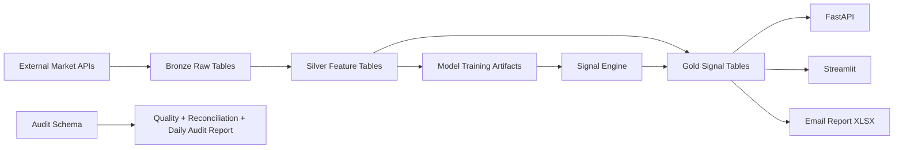
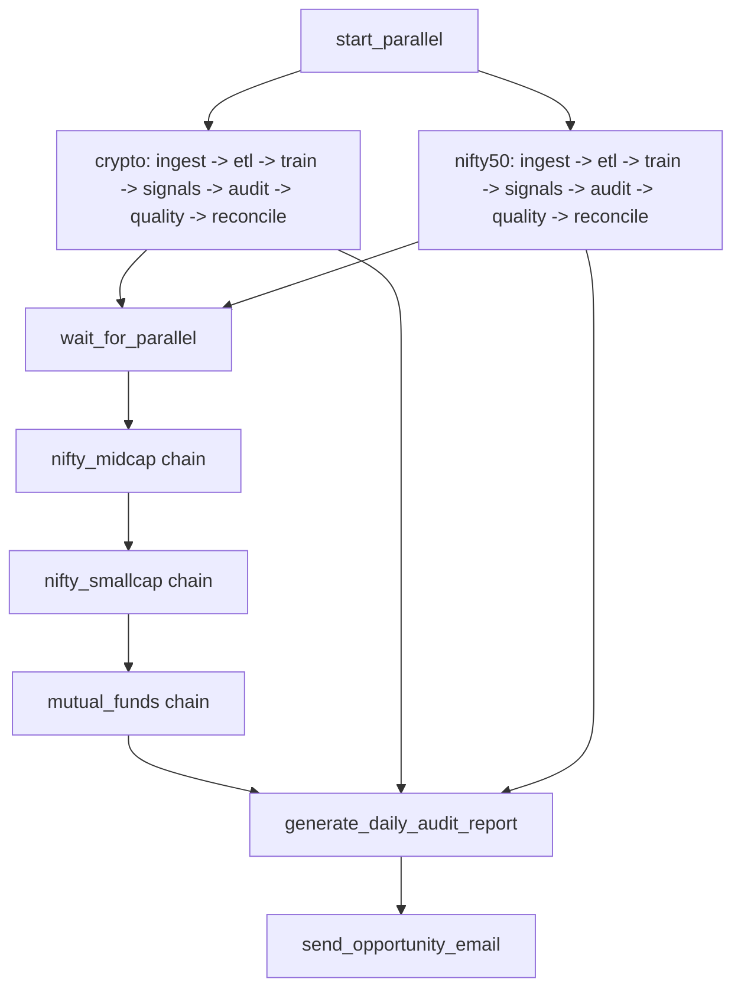

# AI Quant Investment Engine

An open, end-to-end investment analytics product for developers.

This project demonstrates how to build a production-style analytics pipeline that goes from market data ingestion to ML-driven investment signals, with auditability, API access, dashboard UX, and automated email reporting.

## Product Positioning
`AI Quant Investment Engine` is designed as a reference product for the tech community:
- A reproducible architecture for data + ML + serving.
- A practical template for medallion data pipelines (`bronze` -> `silver` -> `gold`).
- A real-world example of adding audit, quality checks, and reconciliation into ML operations.
- A deployment-ready stack using Docker, Airflow, PostgreSQL, FastAPI, Streamlit, and optional local LLM.

This is educational tooling, not financial advice.

## Why This Matters To The Tech Community
- It is opinionated but extensible: enough structure to ship, enough flexibility to learn and extend.
- It covers full lifecycle engineering, not only model training.
- It includes both user-facing delivery channels (UI/API/email) and operator-facing controls (audit and reconciliation).
- It demonstrates how to make ML outputs consumable by non-technical users.

## Core Capabilities
- Multi-source ingestion:
  - `Binance` (crypto OHLCV)
  - `NSE + yfinance` (Nifty 50 / Midcap / Smallcap)
  - `MFAPI` (mutual fund NAV history)
- Distributed feature engineering with PySpark technical indicators.
- Dual-horizon model training (`1y`, `5y`) with CPU-friendly candidate selection (`histgb`, `rf`, `logreg`), calibration, and optional ensemble artifacts.
- Signal generation with probability-to-label business mapping.
- Walk-forward model validation with threshold sweeps, regime analytics, and feature drift diagnostics.
- Auditing framework:
  - ETL start/end logging
  - source-target reconciliation
  - quality metrics and summary views
- Distribution:
  - Streamlit dashboard for exploration
  - FastAPI endpoint for machine consumption
  - formatted Excel report over SMTP email
- Optional local LLM narrative layer via Ollama.

## Tech Stack
- Infrastructure: Docker, Docker Compose, Apache Airflow
- Database: PostgreSQL 15
- Data/ML: Python, PySpark, pandas, scikit-learn, psycopg2
- API/UI: FastAPI, Streamlit
- Local LLM: Ollama (`llama3.2`)

## High-Level Architecture



## Airflow DAG Flow (`ai_quant_daily_pipeline`)



## Repository Map
- `dags/ai_quant_daily_pipeline.py` - orchestration.
- `src/ingestion/` - source connectors and raw writes.
- `src/etl/pyspark_etl.py` - feature generation into `silver`.
- `src/recommendation/train_model.py` - model training.
- `src/recommendation/strategy_engine.py` - inference + signal persistence.
- `src/recommendation/email_alert.py` - report generation + SMTP dispatch.
- `src/audit/` + `database/audit_reconciliation_framework.sql` - observability layer.
- `api/main.py` - REST API.
- `streamlit_app/app.py` - dashboard application.
- `docs/ai_quant_codebase_low_level_guide.pdf` - low-level technical walkthrough.

## Data Model (Simplified)
- `bronze.*_price_raw`: ingested OHLCV/NAV history.
- `silver.*_features_daily`: technical indicators and engineered features.
- `gold.*_investment_signals`:
  - `signal`, `confidence` (primary 1-year view)
  - `signal_1y`, `confidence_1y`
  - `signal_5y`, `confidence_5y`
  - risk fields: `risk_score`, `risk_bucket`, `suggested_position_pct`, `var_95_1d`, `cvar_95_1d`
- `audit.*`: ETL logs, reconciliation, and quality metrics.

## Model Artifact Format
- Trained artifacts are saved under `/opt/airflow/models/` as `*_model.joblib`.
- Each joblib payload is version-tolerant and can be:
  - `single` model artifact (`model`, optional `calibrator`, metadata), or
  - `ensemble` artifact (`models[]` with weights + calibrators, metadata).
- Companion metrics are saved as `*_metrics.json` and include:
  - data quality gate results (`schema_check`, `freshness_check`, outlier rates),
  - candidate leaderboard + selected model(s),
  - evaluation metrics (`eval_roc_auc`, `eval_f1`, `eval_brier`).
- Lightweight experiment tracking files:
  - `/opt/airflow/models/experiments/training_runs.jsonl`
  - `/opt/airflow/models/experiments/model_registry.json`

## Quickstart
Prerequisites:
- Docker + Docker Compose
- ~8GB RAM minimum (16GB recommended with local LLM)

1. Clone and start:
```bash
git clone https://github.com/ramakrushna1994/ai-quant-investment-engine.git
cd ai-quant-investment-engine
docker compose up -d --build
```

2. Configure secrets via `.env` (do not commit this file):
- Postgres credentials
- SMTP settings (`SMTP_USER`, `SMTP_PASSWORD`, `RECEIVER_EMAIL`, etc.)
- Model/training guardrails (optional overrides):
  - `AIQ_MAX_TRAIN_ROWS`, `AIQ_CANDIDATE_SAMPLE_ROWS`
  - `AIQ_MIN_TRAIN_ROWS`, `AIQ_MIN_SYMBOLS`
  - `AIQ_MIN_POS_RATE`, `AIQ_MAX_POS_RATE`
  - `AIQ_MAX_OUTLIER_RATE`, `AIQ_MAX_SOURCE_AGE_DAYS`
  - `AIQ_CALIBRATION_FRACTION`, `AIQ_MODEL_CANDIDATES`, `AIQ_ENABLE_ENSEMBLE`

3. Trigger first run:
- Open Airflow: `http://localhost:8080` (default local auth: `admin/admin`)
- Enable and trigger DAG: `ai_quant_daily_pipeline`

4. Access product surfaces:
- Streamlit UI: `http://localhost:8501`
- FastAPI docs: `http://localhost:8000/docs`
- Example API call:
```bash
curl "http://localhost:8000/api/v1/signals/mutual_funds?min_confidence=0.7&limit=10"
```
- Validation summary API:
```bash
curl "http://localhost:8000/api/v1/validation/summary?asset_class=crypto"
```

## Validation Outputs
- Walk-forward outputs are written to `/opt/airflow/files/reports`:
  - `*_walk_forward_summary.json`
  - `*_walk_forward_splits.csv`
  - `*_walk_forward_buckets.csv`
  - `*_walk_forward_thresholds.csv`
  - `*_walk_forward_model_compare.csv`
  - `*_walk_forward_regimes.csv`
  - `*_walk_forward_drift.csv`
- Validation DAG kwargs now explicitly include:
  - cost/friction knobs (`trading_cost_bps`, `slippage_bps`, `brokerage_bps`, `tax_bps`)
  - drift windows (`drift_recent_days`, `drift_baseline_days`, `drift_min_samples`)
- Reliability guardrails in validation DAGs:
  - per-task `execution_timeout`
  - DAG-level `dagrun_timeout`
  - automatic retries with backoff delay
  - terminal report-freshness check task that fails on missing/stale/corrupt walk-forward artifacts

## Accuracy Guardrails (Daily Publish)
- Daily pipeline now runs two guard tasks before signal publish for each asset class:
  - `freshness_sla_*`: fails fast when silver feature table is stale or too small.
  - `promotion_gate_*`: blocks signal publish unless latest walk-forward report passes quality thresholds.
- Promotion thresholds (env-configurable):
  - `AIQ_PROMOTION_MIN_AVG_ROC_AUC` (default `0.55`)
  - `AIQ_PROMOTION_MIN_AVG_F1` (default `0.40`)
  - `AIQ_PROMOTION_MAX_HIGH_DRIFT_FEATURES` (default `10`)
  - `AIQ_PROMOTION_REQUIRE_DRIFT_OK` (default `true`)

## Product Strategy: How We Reciprocate To The Tech Community
We want this to be a community product, not just a code dump. Our reciprocity model:

1. Open implementation patterns:
- Keep architecture and orchestration explicit (DAG + schema + model flow).
- Document decisions, tradeoffs, and failure modes.

2. Reproducible engineering:
- One-command local environment with Docker Compose.
- Deterministic pipeline behavior through explicit DAG stages and schemas.

3. Educational depth:
- Maintain low-level technical docs and code references.
- Explain not only "what" but "why" at system boundaries.

4. Responsible analytics:
- Make confidence and signal semantics explicit.
- Preserve audit and reconciliation visibility as first-class product behavior.

5. Contributor-friendly roadmap:
- Break work into trackable units (ingestion, ETL, modeling, serving, audits).
- Encourage issue-driven contributions with clear acceptance criteria.

## Community Contribution Tracks
If you want to contribute, pick one lane:
- Data connectors: add new market/exchange/fund sources.
- Feature engineering: add indicators with proper backfill behavior.
- Modeling: improve calibration, backtesting, and model evaluation transparency.
- Product UX: better ranking/filtering, explainability, and signal comparability.
- Reliability: tests, retries, drift detection, and quality guardrails.
- Governance: model cards, changelog discipline, benchmark datasets.

## Known Limitations
- Local LLM latency depends on host hardware.
- Spark jobs are memory-sensitive for large symbol universes.
- Signal quality depends on feature/data quality and is not a guarantee of returns.
- Some SQL table references are dynamic; keep inputs controlled and trusted.

## Responsible Use
- This project is for educational and engineering purposes.
- It does not provide licensed investment advice.
- Always validate outcomes with your own research and risk controls.

## License
This project is licensed under the MIT License. See the `LICENSE` file for details.
