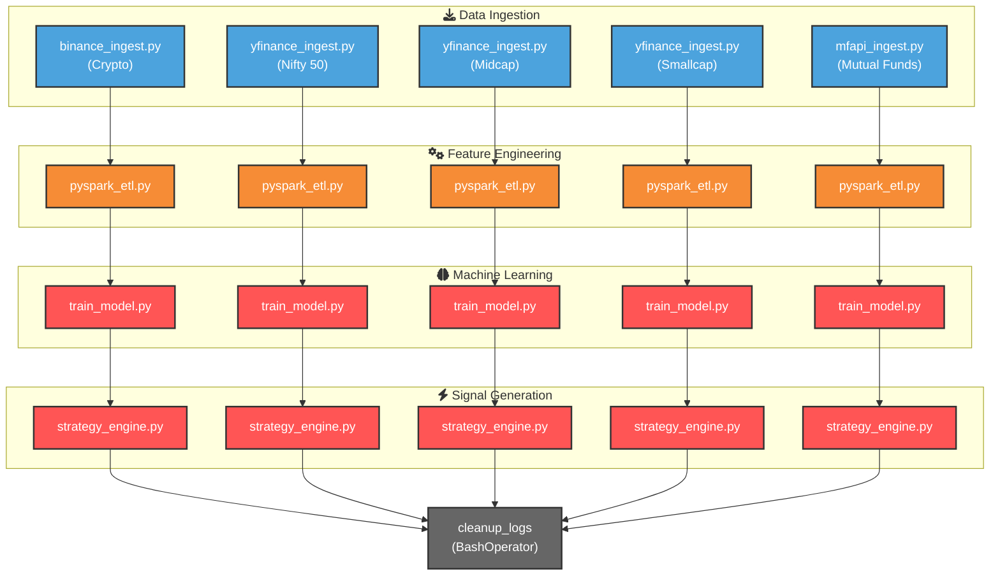
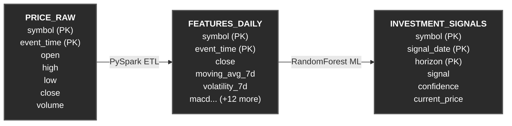

# Crypto Investment Platform

This repository contains a daily data pipeline and machine learning engine for tracking and predicting price movements across cryptocurrencies, Indian equities (Nifty indices), and mutual funds.

It's primarily set up to pull historical daily data, compute technical indicators, and train a Random Forest classifier to output conviction scores (buy/sell/hold signals). There is also a local LLM integration to generate automated analysis summaries.

## Tech Stack
- **Infrastructure:** Docker, Docker Compose, Apache Airflow
- **Database:** PostgreSQL 15 
- **Processing:** Python 3.10+ (Apache Spark/PySpark, Pandas, scikit-learn, psycopg2)
- **Local LLM:** Ollama (Llama 3.2)
- **Frontend & API:** Streamlit (UI) & FastAPI (REST Endpoints)

## Data Sources
Currently fetching daily data from three main sources. No auth keys required.
- **yfinance:** Nifty 50, Midcap, and Smallcap indices. 
- **MFAPI.in:** Daily NAVs for ~3,000 Direct Growth mutual funds across the top 20 AMCs.
- **Binance API:** Top crypto pairs (BTCUSDT, ETHUSDT, etc.).

## How It Works

1. **Ingestion Pipelines:** Scheduled Airflow DAGs hit the APIs mentioned above and bulk-upsert raw OHLCV records into Postgres. 
2. **Feature Engineering (ETL):** `pyspark_etl.py` processes raw data into rolling technical indicators (RSI, MACD, MAs, etc.). 
   *Note:* The mutual fund dataset can get big (3.5M+ rows). To prevent OOM errors, the ETL script batches processing by grouping chunks of 500 symbols at a time before upserting.
3. **ML Training & Inference:** We train a Random Forest classifier (`train_model.py`) to predict 1-year and 5-year growth probabilities. Features are tested sequentially to prevent look-ahead bias. Fallback dummy models are used if a symbol doesn't have enough historical data. The predictions are then written to the `investment_signals` tables.
4. **UI & GenAI:** The Streamlit app reads the signals and technical indicators from Postgres. It also queries a local Ollama container to summarize the indicators into a short, readable analysis paragraph.

### Airflow Pipeline Architecture

The `crypto_daily_pipeline` DAG orchestrates the scripts across all 5 asset classes in parallel. Here is the flowchart of how the scripts execute:



## Database Schema

The platform uses PostgreSQL to store time-series data, technical indicators, and machine learning predictions. All 5 asset classes (`crypto`, `nifty50`, `nifty_midcap`, `nifty_smallcap`, `mutual_funds`) share the identical Tri-Table architectural pattern shown below:



## Local Setup

You'll need roughly 8GB of RAM available (16GB recommended if you plan on running the local LLM).

1. Clone and spin up the environment:
```bash
git clone https://github.com/ramakrushna1994/crypto-investment-platform.git
cd crypto-investment-platform
docker-compose up -d --build
```
*Note: The `ollama-init` service will run briefly on startup to pull the `llama3.2:latest` model and then exit.*

2. Seed the database (Full Backfill):
- Go to the Airflow UI at `http://localhost:8080` (auth: admin/admin).
- Turn on the `crypto_daily_pipeline` DAG and trigger it manually.
- Wait for the pipeline to finish fetching and processing the historical data (default starts at 2016-01-01). Depending on your connection, this usually takes 15-30 minutes.

3. View the Dashboards & APIs:
- Open Streamlit at `http://localhost:8501`.
- Access the RAW ML Signals via the REST API at `http://localhost:8000/docs` (Swagger UI). 
  - *Example GET request:* `http://localhost:8000/api/v1/signals/mutual_funds?min_confidence=0.7&limit=10`

## Quirks & Known Issues
- **Timezone sync:** If your docker host clock drifts, Airflow JWT auth might fail. I've explicitly set `TZ=Asia/Kolkata` across containers to help mitigate this.
- **Slow LLM responses:** Depending on your machine CPU/GPU availability, local Llama 3.2 inference can take a while to return the first token. The connection timeout in `ollama_analyst.py` is bumped up to 120s to account for this.
- **Streamlit widget IDs:** If you extend the frontend to render dynamic buttons in loops, ensure you generate unique `key` arguments to avoid DuplicateWidgetID exceptions.