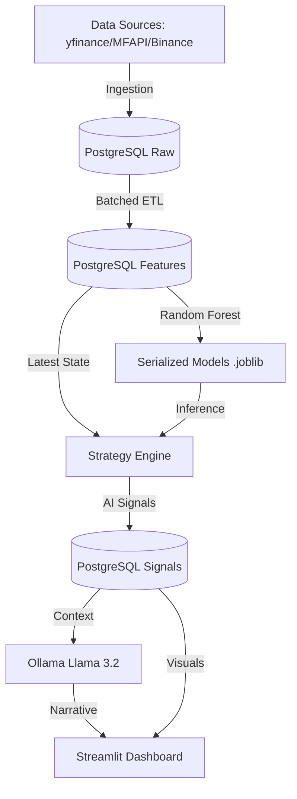

# 🦅 AI Investment Platform

A high-frequency, high-density AI-driven investment engine designed to track, analyze, and predict growth for **Crypto**, **Indian Stocks (Nifty 50, Midcap, Smallcap)**, and **Mutual Funds**.

The platform leverages a custom data-processing architecture to ingest over 10 years of historical data, engineer complex technical features, and train supervised Machine Learning models for mid-to-long term investment horizons.

---

## 🏗️ Architecture & Technical Stack

The system follows a modular **Ingestion -> ETL -> ML -> Insight** pipeline orchestrated via Docker and Airflow.

### 1. Data Ingestion (Raw Layer)
*   **Tools:** `yfinance`, `MFAPI.in`, `Binance API`.
*   **Rationale:** We use asynchronous/parallel fetching (ThreadPoolExecutor) to handle 3,000+ mutual funds and hundreds of stocks efficiently.
*   **Storage:** PostgreSQL (Timescale-ready schema) with indexed `(symbol, event_time)` compound primary keys for rapid updates.

### 2. Feature Engineering (ETL Layer)
*   **Tools:** `Pandas` with **Symbol-based Batching**.
*   **Challenge:** Processing 3.5M+ rows (Mutual Funds) often triggers OOM (Out-of-Memory) errors in containerized environments.
*   **Solve:** We implemented an iterative ETL process in `spark_etl.py`. The engine fetches unique symbols first, then processes them in chunks (e.g., 500 at a time), calculating RSI, MACD, Bollinger Bands, and Volatility without exceeding memory limits.

### 3. Machine Learning (Prediction Layer)
*   **Tools:** `Scikit-Learn` (Random Forest Classifier).
*   **Architecture:**
    *   **Horizons:** Two distinct models are trained per asset: **1-Year (Growth >10%)** and **5-Year (Growth >50%)**.
    *   **Memory Efficiency:** We use column-specific loading and strategic downsampling (capping training sets at 300,000 samples) to ensure model fitting completes within seconds.
    *   **Integrity:** Chronological splitting ensures the model learns from the past to predict the future without look-ahead bias.

### 4. Narrative Intelligence (GenAI Layer)
*   **Tools:** `Ollama` (Llama 3.2).
*   **Function:** Converts raw technical indicators into human-readable investment narratives. Features increased timeouts (120s) to support local inference on varying hardware.

### 5. UI Dashboard
*   **Tools:** `Streamlit`.
*   **Optimization:** Uses `@st.cache_data` and lazy loading for the 3,000+ asset datasets to maintain a smooth 60fps interaction experience.

---

## 🚀 Installation & Setup

### Prerequisites
- Docker & Docker Compose
- (Optional) NVIDIA GPU for Ollama acceleration

### Step 1: Clone and Build
```bash
git clone https://github.com/ramakrushna1994/crypto-investment-platform
cd crypto-investment-platform
docker-compose build
```

### Step 2: Initialize Infrastructure
```bash
docker-compose up -d
```
This starts:
- **Postgres:** Port 5432
- **Airflow:** Port 8080 (Admin: `admin/admin`)
- **Streamlit:** Port 8501
- **Ollama:** Port 11434

### Step 3: Trigger Full Backfill
By default, the system starts empty. To load the 10-year historical dataset:
1. Log in to Airflow at `http://localhost:8080`.
2. Unpause and trigger the `crypto_daily_pipeline` DAG.
3. This will perform the full Ingestion -> ETL -> Training sequence (~15-30 minutes depending on internet speed).

---

## 🛠️ Key Technical Solves

### The OOM (Out-of-Memory) Problem
The platform originally crashed when processing the 3.4M rows of Indian Mutual Fund data. 
**The Fix:** 
- In `spark_etl.py`, we replaced `SELECT *` with symbol-chunked queries. 
- In `train_model.py`, we implemented categorical encoding for symbols and computed labels *before* downsampling to preserve time-series sequence integrity.

### Authentication & Time Drift
Airflow DAGs were failing due to `iat` token errors (clock skew).
**The Fix:** 
Universal synchronization of the platform to `TZ=Asia/Kolkata` across all Docker services and the host system, ensuring consistent timestamp generation for PostgreSQL and JWT tokens.

### Single-Class Model Resilience
Fallover mechanisms in `strategy_engine.py` ensure that if an asset lacks enough historical data for a 5Y horizon, a "HOLD" fallback model is generated, preventing `IndexError` during batch inference.

---

## 📈 Monitoring
You can monitor the health of the backfill and AI training cycles directly in the Airflow UI or by tailing the logs:
```bash
docker logs -f crypto-streamlit
docker logs -f airflow-api-server
```

---

## 👨‍💻 Technical Architecture Diagram

